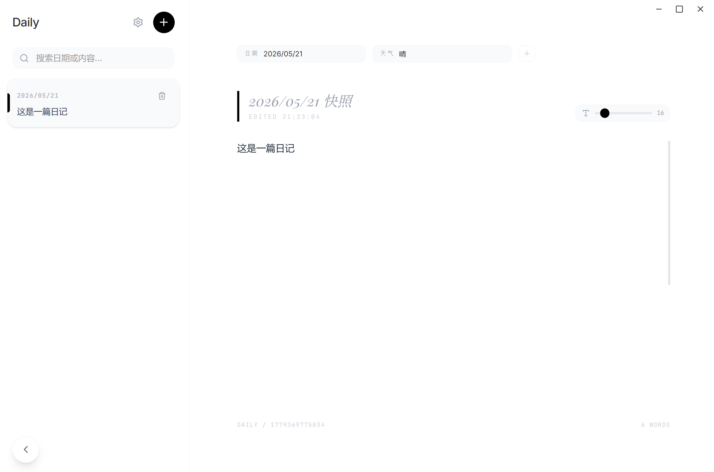

# Daily - 桌面日记应用

一个基于 **Electron + React + TypeScript** 构建的现代化桌面日记应用，提供优雅的书写体验与个性化定制能力。

---

## 📸 应用预览



---

## ✨ 核心特性

### 📝 优雅的日记编辑

- **自由书写** - 纯文本编辑区，无干扰的写作环境
- **智能日期** - 新建日记自动填写日期，凌晨 6 点前自动记为前一天
- **可调字体** - 每篇日记独立调节字号（12-48px），支持 4 种字体预设
- **标签系统** - 内置「日期」「天气」标签，支持自定义标签
- **图片画廊** - 支持多图上传、拖放、预览和删除
- **评论功能** - 为日记添加多条评论，支持编辑和删除，时间戳精确到分钟
- **自动保存** - 500ms 防抖自动同步，无需手动保存

### 🎨 个性化定制

- **主题色切换** - 7 种预设色彩（黑、蓝、橙、绿、红、紫、粉）
- **字体预设** - 系统默认 / 宋体 / 楷体 / 黑体，适配中文书写习惯
- **全局字号** - 新日记默认字号可配置（12-48px）
- **侧边栏折叠** - 为书写提供更专注的空间

### 🔍 日记管理

- **搜索过滤** - 按日期或内容快速查找
- **侧边栏列表** - 时间倒序排列，内容预览自动去除行首空格
- **二次确认删除** - 防止误删重要日记

### 💾 数据管理

- **数据迁移** - 设置面板查看当前数据路径，一键迁移到自定义目录
- **指针文件** - 迁移后在默认位置保留路径记录，重启自动定位新目录
- **本地存储** - 所有数据离线可用，JSON 格式易于备份

### 🖼️ 沉浸体验

- **图片预览** - 点击图片全屏放大，毛玻璃背景
- **原生窗口控制** - 自定义标题栏，支持拖拽区域
- **流畅动画** - Framer Motion 驱动的进出场过渡
- **玻璃拟态** - 现代 Glassmorphism 设计风格

---

## 🛠️ 技术栈

| 领域     | 技术                   |
| -------- | ---------------------- |
| 前端框架 | React 19 + TypeScript  |
| 构建工具 | Vite 6                 |
| 样式方案 | Tailwind CSS 4         |
| 动画库   | Framer Motion (motion) |
| 桌面框架 | Electron 42            |
| 后端服务 | Express 4              |
| 数据存储 | 本地文件系统 (JSON)    |
| 日期处理 | date-fns               |
| 图标库   | Lucide React           |

---

## 📦 项目结构

```
daily-diary/
├── src/
│   ├── App.tsx              # 主组件（侧边栏 + 编辑器 + 设置面板）
│   ├── main.tsx             # React 入口
│   ├── index.css            # 全局样式（主题、玻璃拟态、字体预设、滚动条）
│   ├── electron.d.ts        # Electron API 类型声明
│   ├── lib/
│   │   └── dateUtils.ts     # 日期工具（凌晨 6 点前自动修正）
│   └── types.ts             # TypeScript 类型定义
├── server.ts                # Express 后端服务（REST API + 数据迁移）
├── electron-main.cjs        # Electron 主进程（窗口 + IPC + 路径解析）
├── preload.cjs              # 预加载脚本（IPC 桥接）
├── data/                    # 数据存储目录（自动生成）
│   ├── diaries/             # 日记 JSON 文件
│   └── settings.json        # 用户设置
├── dist/                    # 构建输出
└── package.json
```

---

## 🚀 快速开始

### 环境要求

- Node.js ≥ 18
- npm 或 yarn

### 安装依赖

```bash
npm install
```

### 开发模式

**方式一：仅运行后端服务**

```bash
npm run dev
# 后端服务启动在 http://localhost:3000
```

**方式二：完整 Electron 开发**

```bash
npm run electron:dev
# 自动启动后端 + Electron 窗口
```

### 构建应用

```bash
npm run electron:build
```

**构建输出：**

- Windows: `release/Daily Setup {version}.exe` (NSIS 安装包)
- macOS: `release/Daily {version}.dmg`

---

## 📄 数据存储

所有数据存储在本地，完全离线可用：

| 数据类型 | 存储路径                     |
| -------- | ---------------------------- |
| 日记文件 | `data/diaries/{id}.json`   |
| 用户设置 | `data/settings.json`       |
| 路径指针 | `{userData}/datapath.json` |

**数据结构示例：**

```json
{
  "id": 1703123456789,
  "content": "今天是个好日子...",
  "date": "2026/07/15",
  "tags": [
    { "label": "日期", "value": "2026/07/15", "isRemovable": false },
    { "label": "天气", "value": "晴", "isRemovable": true }
  ],
  "images": ["data:image/png;base64,..."],
  "comments": [
    { "id": 1703123456790, "content": "确实不错！", "createdAt": 1703123456790 }
  ],
  "fontSize": 18,
  "updatedAt": 1703123456789
}
```

### 数据迁移

在设置面板的「数据管理」区域：
1. 查看当前数据存储路径
2. 点击「选择目标目录」选择新位置
3. 点击「迁移数据」完成迁移
4. 重启应用后自动使用新路径

迁移后，默认位置仅保留 `datapath.json` 指针文件，记录自定义数据路径。

---

## 🎯 使用指南

### 基础操作

| 操作       | 方法                                     |
| ---------- | ---------------------------------------- |
| 新建日记   | 点击侧边栏顶部的 `+` 按钮              |
| 编辑日记   | 点击侧边栏中的日记卡片                   |
| 搜索日记   | 在侧边栏搜索框输入关键词                 |
| 删除日记   | 点击日记卡片的 `🗑️` → 再次确认       |
| 调节字号   | 使用编辑器右上角的滑块                   |
| 添加标签   | 点击标签区域末端的 `+` → 输入标签名   |
| 上传图片   | 点击图片区域的「Upload Image」或拖放图片 |
| 预览图片   | 点击任意图片                             |
| 添加评论   | 在正文下方评论框输入 → 点击发送或回车  |
| 编辑评论   | 悬停评论 → 点击 ✏️ → 修改 → 保存     |
| 删除评论   | 悬停评论 → 点击 🗑️                    |
| 打开设置   | 点击侧边栏的 `⚙️` 图标               |
| 折叠侧边栏 | 点击左下角的 `<` 按钮                  |

### 标签说明

- **日期标签** - 不可删除，修改后日记日期同步更新
- **天气标签** - 可删除，支持自定义值（晴/阴/雨/雪等）
- **自定义标签** - 可随意添加和删除

---

## 🔧 配置说明

### 环境变量

```bash
PORT=3000             # 后端服务端口
DATA_PATH=./data      # 当前数据存储路径
DEFAULT_DATA_PARENT   # 指针文件存放目录（生产环境为 %APPDATA%/Daily）
```

### 应用设置

通过设置面板可配置：

| 设置项             | 说明                                  | 默认值     |
| ------------------ | ------------------------------------- | ---------- |
| `themeColor`       | 主题色                                | `#000000`  |
| `fontPreset`       | 编辑字体（system/serif-cn/kaiti/heiti） | `system` |
| `defaultFontSize`  | 新日记默认字号（12-48px）             | `16`       |

---

## 📝 开发说明

### 脚本命令

| 命令                       | 说明                   |
| -------------------------- | ---------------------- |
| `npm run dev`            | 启动后端服务（tsx）    |
| `npm run build`          | 构建前端 + 打包后端    |
| `npm run electron:dev`   | 启动 Electron 开发环境 |
| `npm run electron:build` | 打包生产版本           |

### 构建配置

**Electron Builder 配置要点：**

- Windows 目标: NSIS (可自定义安装路径)
- macOS 目标: DMG
- 图标: `icon.ico` (Windows) / `icon.icns` (macOS)

### 架构说明

- **渲染进程 ↔ Express 服务器**：通过 HTTP REST API 通信（localhost:3000）
- **渲染进程 ↔ Electron 主进程**：通过 IPC 通信（窗口控制、文件夹选择器）
- **Express 服务器**：由 Electron 主进程 fork 启动，通过环境变量传递配置
- **数据持久化**：JSON 文件存储，POST 全量覆写

---

## 📄 许可

MIT License © 2026

---

## 🙏 致谢

- [Lucide](https://lucide.dev/) - 精美的开源图标库
- [Framer Motion](https://motion.dev/) - 流畅的动画库
- [Tailwind CSS](https://tailwindcss.com/) - 高效的 CSS 框架
- [date-fns](https://date-fns.org/) - 轻量级日期工具库
